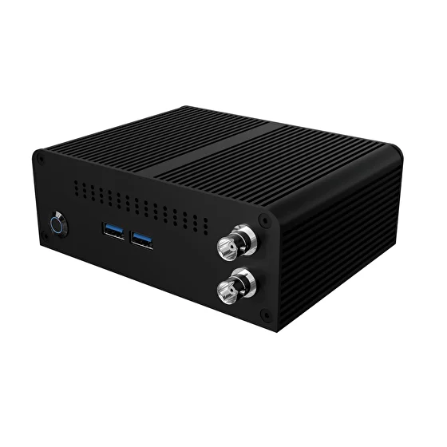
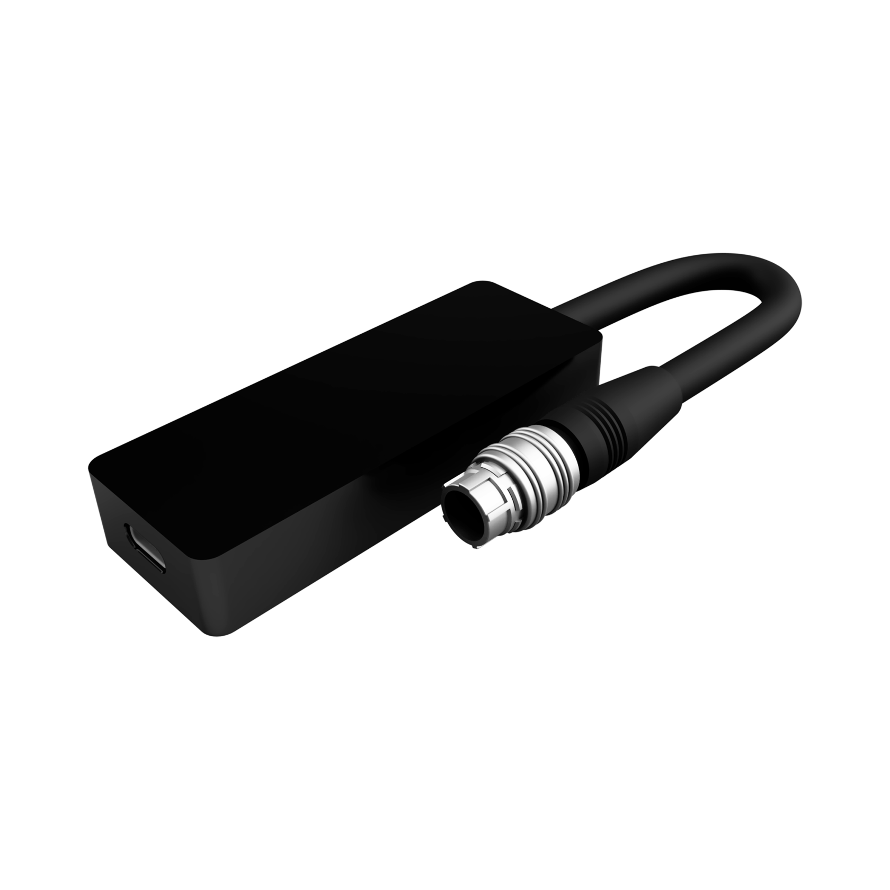

# Комплектация

## Рабочая станция Camix Prizm PC

<figure><figcaption>
Рабочая станция Camix Prizm
</figcaption></figure>

### Технические характеристики:

* Intel Core i3-8145U
* Intel UHD Graphics 620
* Kingston SSD 120Gb
* Patriot DDR4 4Gb
* Blackmagic DeckLink SDI Micro
* Wi-Fi
* Bluetooth
* OC Windows 10 64 Bit
*

### Разъемы:

* BNC SDI Video input
* BNC SDI Reference input
* USB 3.1 (3)
* USB 2.0
* HDMI (2)
* Gigabit Ethernet
*

### Габариты

* компьютер (140 х 135 х 50 мм)
* блок питания
* Wi-Fi антенна (2)

Энкодер Camix Gear

<figure><figcaption>
Энкодер Camix Gear
</figcaption></figure>

Энкодер Camix Servo

<figure><figcaption>
Энкодер Camix Servo
</figcaption></figure>

Transmitter FreeD

Beacon LED

Аксессуары Camix Rigs
