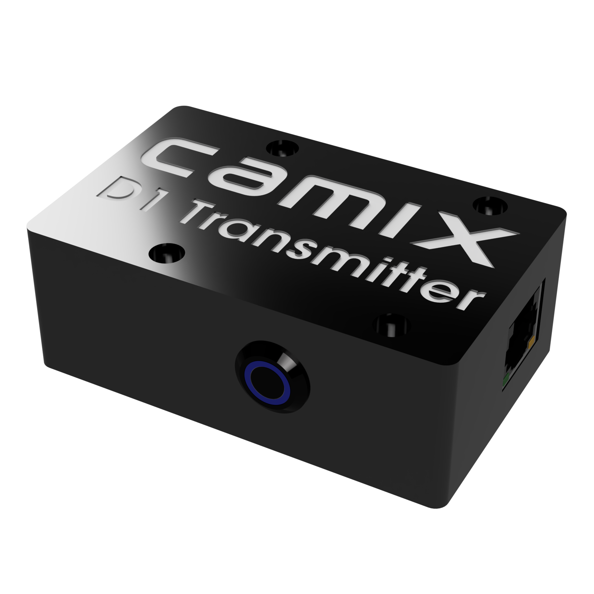

# Комплектация

## Рабочая станция Camix Prizm PC

<figure><figcaption>
Рабочая станция Camix Prizm
</figcaption></figure>

### Технические характеристики:

* Intel Core i3/i5/i7
* Intel UHD Graphics 620
* Kingston SSD 120Gb
* Patriot DDR4 4Gb
* Blackmagic DeckLink SDI Micro
* Wi-Fi
* Bluetooth
* OC Windows 10 64 Bit

### Разъемы:

* BNC SDI Video input
* BNC SDI Reference input
* USB 3.1 (3)
* USB 2.0
* HDMI (2)
* Gigabit Ethernet

### Габариты

* компьютер (140 х 135 х 50 мм)
* блок питания
* Wi-Fi антенна (2)

## Энкодер Camix Gear

<figure><figcaption>
Энкодер Camix Gear
</figcaption></figure>

### Технические характеристики:

* точность - 131 072 значений на оборот
* частота получения данных - 240 Гц
* крепление на 15мм риг

### Разъемы:

* USB 3.1 type-C

### Комплектация:

* энкодер (95 х 35 х 10 мм)
* шестерни 0.4, 0.5, 0.6, 0.8 модулей (50 х 50 х 5 мм)

## Энкодер Camix Servo

<figure><figcaption>
Энкодер Camix Servo
</figcaption></figure>

## Transmitter FreeD

<figure><figcaption>
Camix FreeD Transmitter
</figcaption></figure>

## Beacon LED

## Аксессуары Camix Rigs
