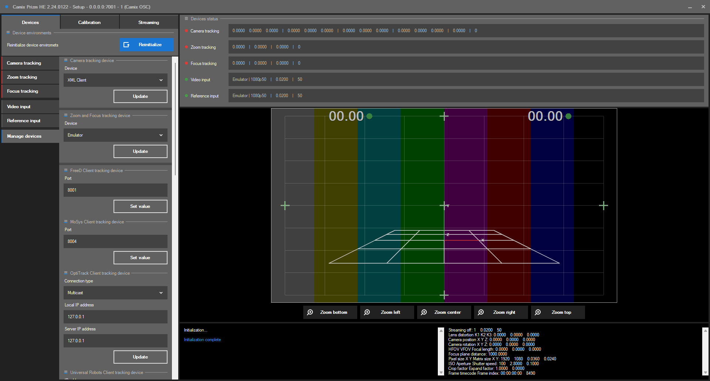

# Настройка устройств

В данном разделе производится настройка ПО для сопряжение его с используемыми вами устройствами. Обязательно пройдите шаги настройки вашей системы согласно инструкции, так как для разных систем они могут отличаться.

<figure><figcaption></figcaption></figure>
