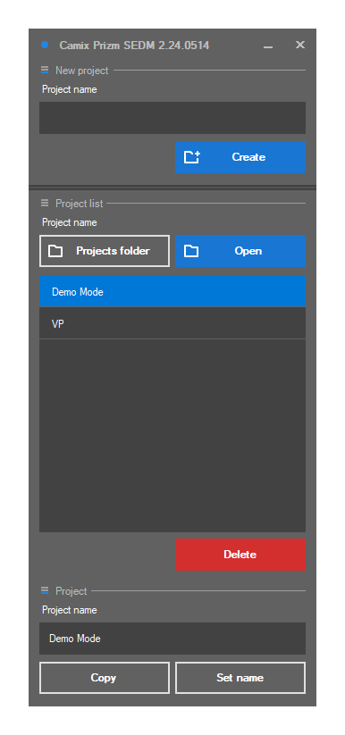
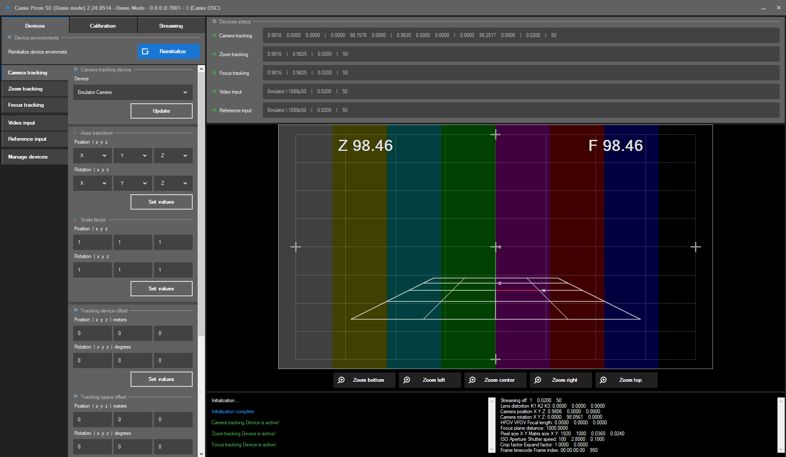

# Описание интерфейса

Интерфейс приложения Camix Prizm состоит из двух окон:

* Окно управления проектами

<figure><figcaption></figcaption></figure>

* Окно проекта

<figure><figcaption></figcaption></figure>
