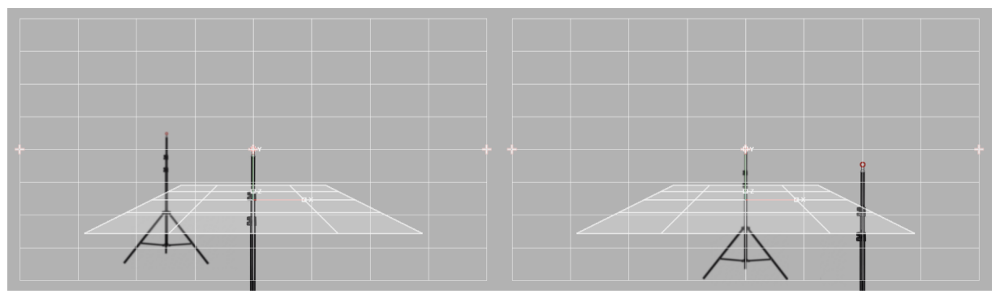
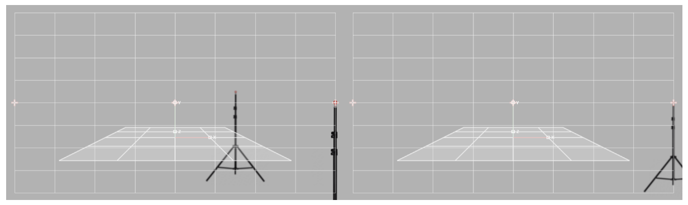
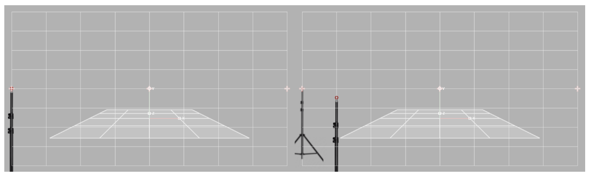

# Калибровка Camera Position

1. Разместите метки на штативах на расстоянии 1 метр и вторую на расстоянии 3-4 метра от камеры. При помощи рулеткии создайте 2 [**tracking points**](../sozdanie-tochek/tracking-points.md)

<figure><figcaption></figcaption></figure>

**Замечание**: рекомендуем располагать точки на разной высоте и со смещением, после расположения убедитесь что если посмотреть на дальнюю точку углом кадра, первая точка ее не перекрывает.

<figure><figcaption></figcaption></figure>



**Правило**: для вычисления положения виртуальной камеры (смещения точки виртуальной камеры относительно трекера) необходимо совершить 6 измерений положения и ориентации камеры на значениях фокуса 0 и 1 для следующих положений зума: 0, 0.25, 0.5, 1, относительно заданных точек:

1. камера нацелена центральным перекрестием в окне видеозахвата на ближнюю точку
2. камера нацелена центральным перекрестием в окне видеозахвата на дальнюю точку

<figure><figcaption></figcaption></figure>

3. камера нацелена правым перекрестием в окне видеозахвата на ближнюю точку
4. камера нацелена правым перекрестием в окне видеозахвата на дальнюю точку

<figure><figcaption></figcaption></figure>

5. камера нацелена левым перекрестием в окне видеозахвата на ближнюю точку
6. камера нацелена левым перекрестием в окне видеозахвата на дальнюю точку

<figure><figcaption></figcaption></figure>

2. Перейдите в раздел **Calibration** -> **Camera Position**. В разделе **Layout**, в поле **Nearest point** укажите ближнюю точку, а в поле **Distant point** - дальнюю точку. Зум и фокус установите в минимальные значения. Наведитесь центральным крестиком на ближнюю точку (для точного позиционирования, воспользуйтесь цифровым приближением **Zoom center**). Нажмите на кнопку **Set layout**. В поле **Camera position**, переключите значение на шаг 2 и проделайте данную процедуру для следующей точки. По завершению 6 измерений, нажмите на. кнопку **Calibrate.** Измените значение фокуса и проделайте процедуру снова. &#x20;



**Замечание**: Для удобства рекомендуем закрыть диафрагму и ориентироваться на подсказку. В разделе **Calibration data** красным отмечены позиции на которых вам необходимо сделать калибровку, после создания калибровки, в графике точка соответсвующая данным поменяет цвет на зеленый.

<figure><figcaption></figcaption></figure>

